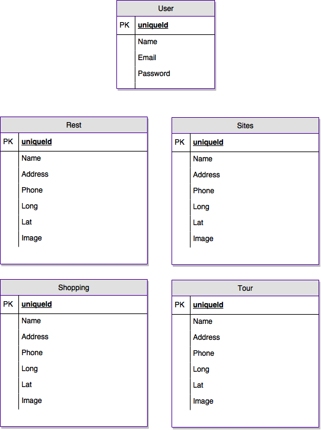
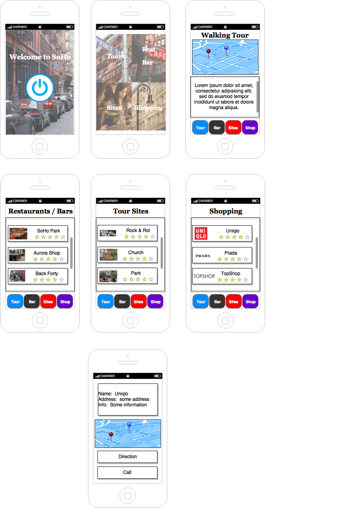
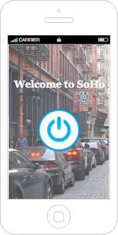
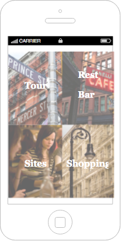
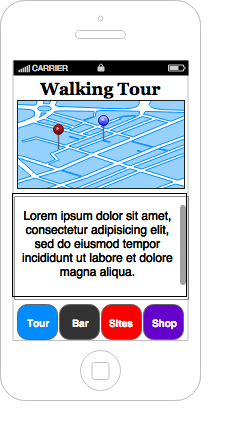
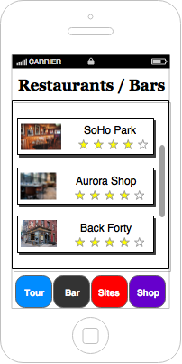
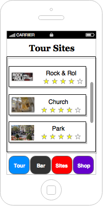
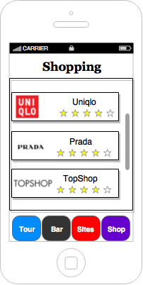
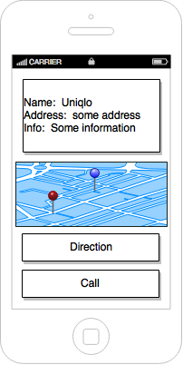

## Walking Tour iOS App (SoHo)

### Brief Description

Guided (SoHo) walking tour iOS App from a perspective of local - showcasing off the beat sites, restaurants, bars and shopping destinations.

### Technologies
  * React Native
  * Firebase Database
  * Google Map
  * APIs: Yelp (Bonus)

### User Stories
  * As a user, I should be able to open the iOS app and be taken to a landing page
    * Bonus: As a user, I should be able to login
    * Bonus: As a user, I should have the option of logging in with Facebook or setup new account
    * Bonus: As a user, I should be able to sign up through a form
    * Bonus: As a user, I should be able to login a guest without have to sign up or sign in through Facebook
    * Bonus: As a user, I should be able to logout
  * As a user, once the app started, I should be have options to redirect me to the Dashboard Page (Tour, Restaurants/Bars, Sites & Shoppings)
  * As a user, when I touch the Tour section, I should be redirect to the Tour section
    * As a user, once I am inside the Walking                                      Tour section, I should be able to start, continue and end the walking tour
    * As a user, I should be able to see the route for the tour on a map
    * As a user, I should be able to see the description of the POI
    * As a user, I should be able to pause the tour and explore the whats around the POI
    * As a user, I should be able to continue the tour to the next POI
  * As a user, when I touch the Rest/Bar section, I should be redirect to the Rest/Bar section
    * As a user, I should be able to see all the nearby POI based on proximity
    * As a user, I should be able to see a brief description of the listings
    * As a user, I should be able to scroll through and see all the listings
    * As a user, I should be able to click on one listing and see a detail page of the current listing
  * As a user, when I touch the Sites section, I should be redirect to the Site section
    * As a user, I should be able to see all the nearby POI based on proximity
    * As a user, I should be able to see a brief description of the listings
    * As a user, I should be able to scroll through and see all the listings
    * As a user, I should be able to click on one listing and see a detail page of the current listing
  * As a user, when I touch the Shopping section, I should be redirect to the Shopping section
    * As a user, I should be able to see all the nearby POI based on proximity
    * As a user, I should be able to see a brief description of the listings
    * As a user, I should be able to scroll through and see all the listings
    * As a user, I should be able to click on one listing and see a detail page of the current listing
  * As a user, when I click on any current listings, I should be redirected to a detail page listing.
    * As a user, once I am inside the detail render page, I should be able to see Name, Address, brief description, and contact information
    * As a user, I should be able to see where this current listing is on a map
    * As a user, I should be given the option to get direction to the listing based on their current location
    * As a user, I should be given the option of making a call to the listing.
  * As a user, I should have access to a static menu to access Tour, Bar, Sits & Shop from any page except landing page and Dashboard
    * As a user, depend on which button I press, I should be taken to that section.

### ERDs

### Wireframes
##### Overall Wireframe

##### Landing Page Wireframe

##### Dashboard Page Wireframe

##### Tour Page Wireframe

##### Restaurants/Bars Page Wireframe

##### Additional Tour Sites Page Wireframe

##### Shopping Page Wireframe

##### Rendering Page Wireframe

### Planning / Deadlines

| Date     | Task     | Comments     |
| :------------- | :------------- | :------------- |
| March 30 (Wednesday) | React Native Mobile iOS App concept proofing & mockup       |        |
| March 31 (Thursday) | iOS App Planning  |        |
| April 1 (Friday) | iOS App Setup (Landing Page & Dashboard)  | completed with signup/login with firebase and added animation       |
| April 2 (Saturday) | Rest / Bar page  | completed the page with seeded data ... still need to add animations & styling |
| April 3 (Sunday) | Sites page  | completed the page with seeded data ... still need to add animations & styling  |
| April 4 (Monday) | Shopping Page  |  completed the page with seeded data ... still need to add animations & styling |
| April 5 (Tuesday) | Tour Page  | able to add map marker       |
| April 6 (Wednesday) | Tour Page |        |
| April 7 (Thursday) | Tour Page  |        |
| April 8 (Friday) | Debugging / Deployment  |        |
| April 9 (Saturday) | Debugging / Deployment  |        |
